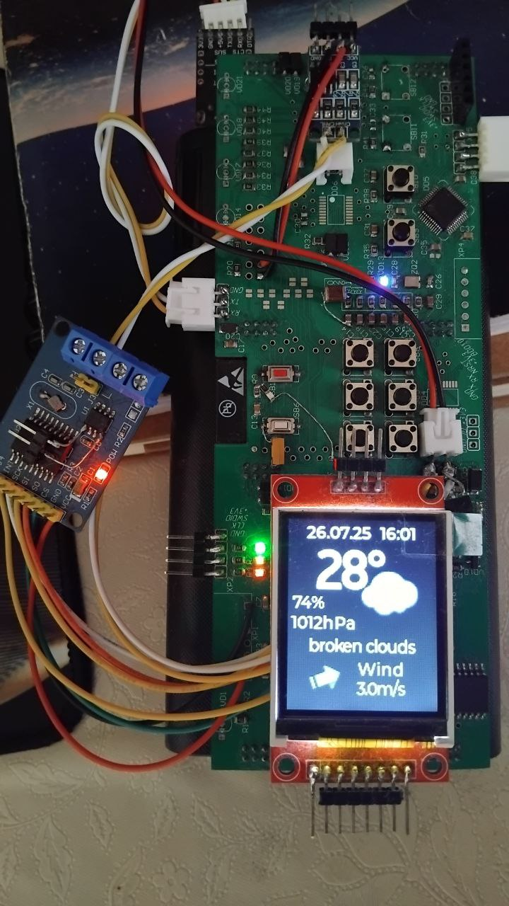
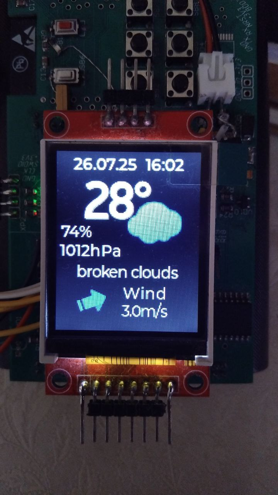
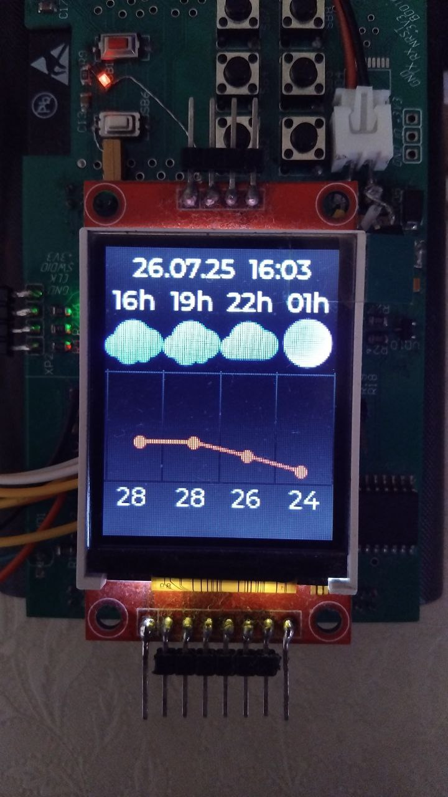
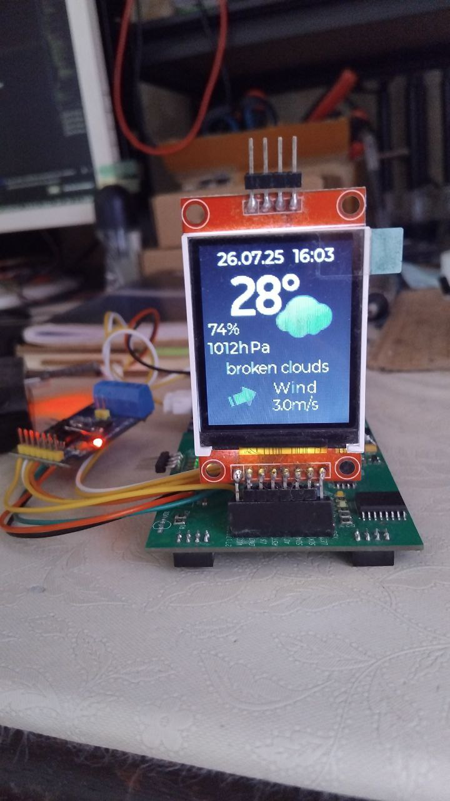

# STM32F411 display module for weather station

* asks all data from ESP32 about current time and weather forecast via CAN bus (SPI-CAN bridge MCP2515)
* displays clock and forecast on 1.8 inch spi display
* based on LVGL 9 library

## Demo

